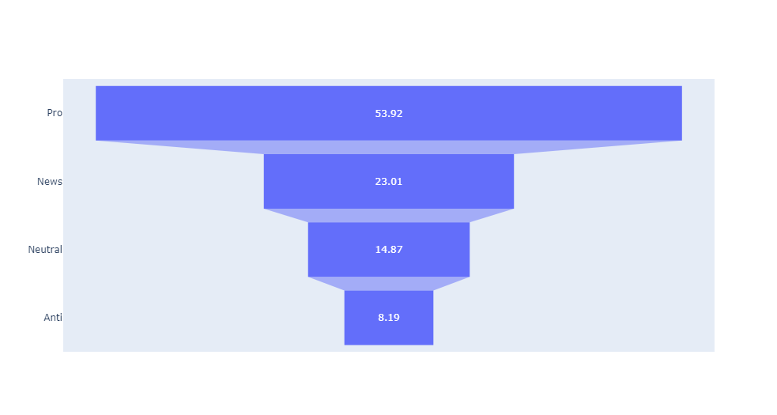
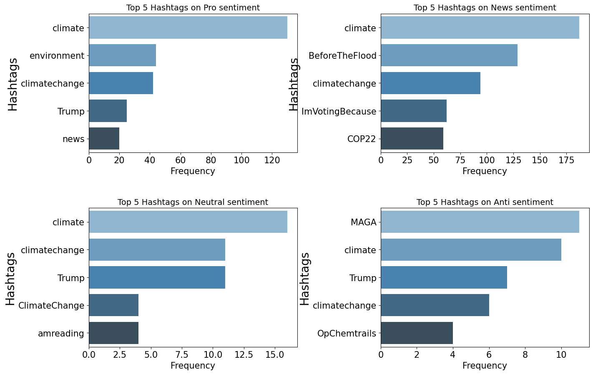
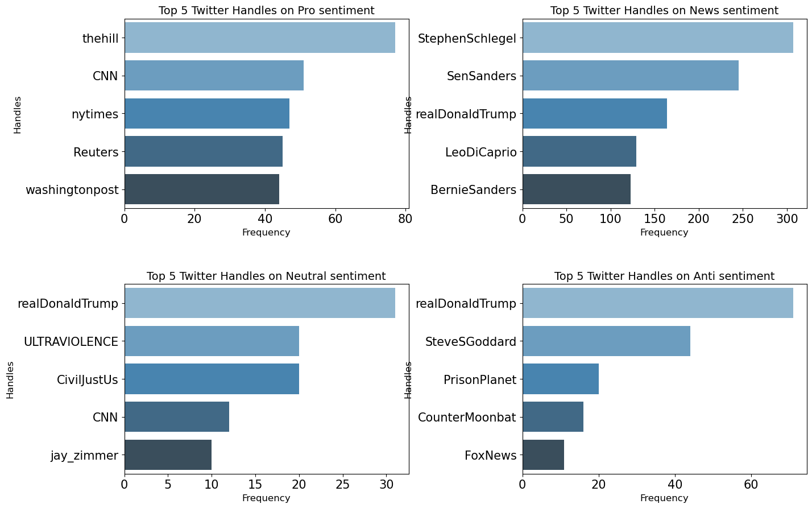
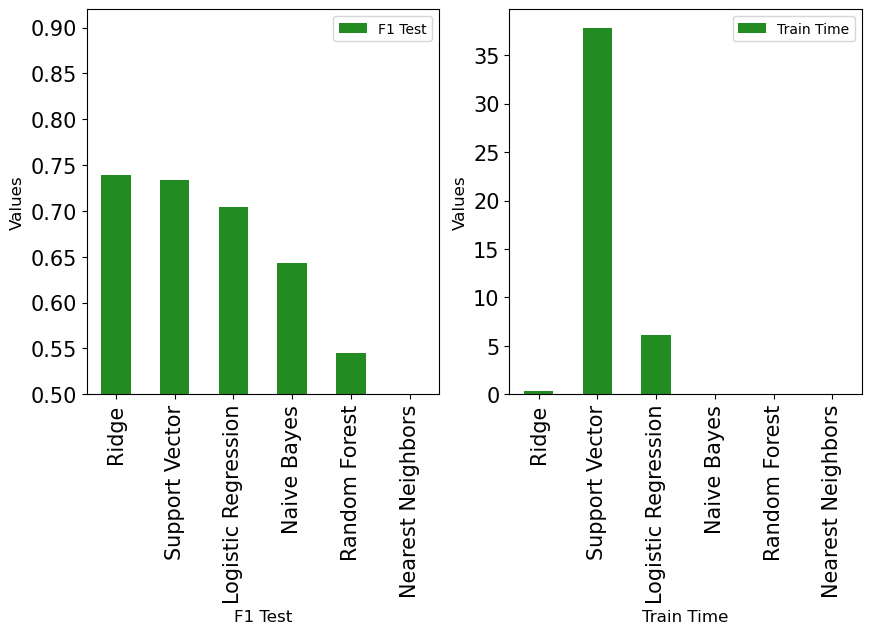

# Climate Change Sentiment Analysis - Exploratory Data Analysis

This project aims to understand the public perception of climate change and its perceived threat level by analyzing individuals' beliefs based on their tweet data. The objective is to develop a machine learning model that can classify individuals' sentiments towards climate change, providing valuable insights for market research and future marketing strategies.

## Dataset Overview

The dataset consists of tweet data with the following columns:
- `sentiment`: Class label representing the belief in climate change (0: Neutral, 1: Pro, -1: Anti, 2: News)
- `message`: Tweet body
- `tweetid`: Twitter unique ID

The training dataset contains 15,819 entries, while the test dataset contains 10,546 entries. The sentiment column contains four unique values, representing different classes of beliefs. The tweetid column is a case of high cardinality and will be dropped during the preprocessing phase.

## Class Imbalance

The training dataset exhibits a class imbalance, with a majority of tweets falling under the "Pro" sentiment category, indicating strong support for the belief in man-made climate change. This imbalance could lead to a model that performs well at categorizing certain sentiment categories but performs poorly on others.

## Word Analysis

The unprocessed training dataset contains approximately 280,000 total words and 48,000 unique words. On average, each tweet contains around 3.158 unique words. This analysis provides insights into the language usage within the tweets.

## Mentions and Hashtags Analysis

The analysis reveals that the "Anti" and "Pro" sentiments have the most mentions per tweet, with most tweets containing at least one mention. The top hashtags used in the tweets include "Climate," "climate change," "Trump," and "Before the flood." The hashtag "Before the flood" is popular among pro-climate change tweets and refers to a 2016 documentary highlighting the dangers of climate change. The hashtag "MAGA" (Make America Great Again) is popular in anti-climate change tweets, associated with support for Donald Trump.

## Popular Handles

The most popular news handles are actual news stations' handles, while the most popular pro handles consist of celebrity accounts and news station handles. Donald Trump is prominently mentioned in the most popular anti and neutral tweets.

## Tweet Preprocessing

The dataset contains various elements such as punctuations, URLs, emojis, hashtags, mentions, and retweets. A preprocessing function has been implemented to clean the tweet data, removing these elements to ensure better analysis and model performance.

- **Dropping TweetId Feature**: The `tweetId` feature is dropped from the dataset since it contains unique values and doesn't contribute significantly to the model's accuracy. Removing this feature helps reduce computational cost.

- **Stop Words**: Stop words, which are common words that don't carry significant meaning in a language, are typically removed from text analysis. However, it is not explicitly mentioned in the provided content whether stop words were removed or not.

- **Lemmatization**: Lemmatization is performed to reduce words to their base or root form (lemma). This process helps to standardize the text and reduce inflected forms. Examples of lemmatization include reducing "running" to "run" and "cars" to "car."

- **Splitting Train Dataset**: The training dataset is split into a training set and a validation set. The training set is used to train the model, while the validation set is used to evaluate the model's performance on unseen data.

- **Feature Selection**: The dataset contains a large number of features (105,864), but not all of them contribute positively to the model's performance. Feature selection using the KBest method is employed to select the most relevant features for the model.

- **Correcting Imbalance with Oversampling**: Class imbalance is addressed using the Synthetic Minority Oversampling Technique (SMOTE). SMOTE generates synthetic data points to increase the representation of minority classes, improving the model's ability to predict all classes effectively.

- **Model Evaluation and Performance**: Classification models are developed, trained, and evaluated using accuracy, precision, and recall metrics. The Random Forest Classifier, Ridge Classifier, Support Vector Machine, Logistic Regression, Naive Bayes, and K-Nearest Neighbors classifiers are evaluated.

- **Random Forest Classifier Model**: The Random Forest Classifier is an ensemble learning algorithm that constructs multiple decision trees using random subsets of the training data and features. The model's accuracy is evaluated using a confusion matrix, indicating that it predicts the correct sentiment 71% of the time.

- **Ridge Classifier**: The Ridge Classifier, a linear model, is considered due to the high-dimensional nature of the problem. It shows high accuracy, precision, recall, and F1 scores.

- **Nearest Neighbor Classifier**: The K-Nearest Neighbor classifier, a nonparametric classification method, is considered to explore a different approach. It uses the plurality of votes from its neighbors for classification.

The provided content also includes a table showing the accuracy, precision, recall, F1 scores, and training time for each classifier.

- **Outcome**: The F1 scores for both the training and test datasets vary across the classifiers, with the highest scores observed for the Ridge Classifier (F1 Train: 0.993915, F1 Test: 0.738938). The training times also vary significantly, with the Support Vector Machine classifier having the longest training time (37.860469 seconds), while the Nearest Neighbors classifier has the shortest training time (0.002232 seconds).